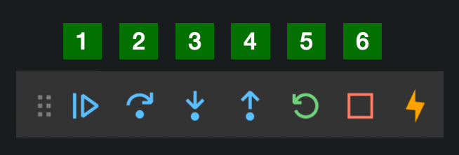

## REST API

### Definitions

- `API`: Mediator between a consumer and a system
- `REST API`: API that conforms to a set of guidelines.
- `JSON`: universal format of key-value pairs that all systems can understand.
```
{
"name": "Tyrion Lannister",  //JSON STRING
"phoneNumber": "4515429321",  // JSON STRING
"age": 40,  // JSON NUMBER
"height": 1.2,  // JSON NUMBER
"siblings": [ "Cersei", "Jaime" ], // JSON ARRAY
"alwaysDrunk": true // JSON BOOLEAN
}
```

### REST Guidelines:
- **Resource:** piece of data that can be named (Contact, Employee).
- **URI:** Uniform Resource Identifier – identifies the location of a resource.
- The API defines operations that can manipulate resources:
  - `GET`: retrieves a resource.
  - `POST`: creates a resource.
  - `PUT`: updates a resource.
  - `DELETE`: deletes a resource.
- The resource is most often serialized into JSON.

### Spring Boot REST
- `@RESTController`:
Combines @Controller and @ResponseBody.
- `@GetMapping`, `@PostMapping`, `@PutMapping`, `@DeleteMapping`:
  - method-level annotations that instrument methods to handle different types of requests.
- `@ResponseBody`:
  - is capable of serializing a returned Object into JSON.
- `@RequestBody`
  - is capable of deserializing incoming JSON data into the fields of an object.
- `@PathVariable`: extracts a variable from the provided path.
- `ResponseEntity<Object>`:
  - object is serialized into JSON before being sent off.
  - can also return an HTTP status code. See Mozilla Status Codes.
- `@JsonFormat`: can configure how properties get serialized. The following example serializes the annotated field into a JSON STRING, with a pattern of dd-MM-yyyy hh:mm:ss.
```
@JsonFormat(shape = JsonFormat.Shape.STRING, pattern = "dd-MM-yyyy hh:mm:ss")
```
- `@Valid`: validates fields based on your constraints

### Exception Handling
- `@ControllerAdvice`: class-level annotation that allows you to define global exception handlers.
- `handleMethodArgumentNotValid`: method that can be overridden from the `ResponseEntityExceptionHandler` parent class. You can handle field violations and get the `BindingResult` here.
- `@ExceptionHandler`: method-level annotation that defines an exception handler.


1. Define the exception that you want the method to handle.
2. Pass the exception into the list of arguments.