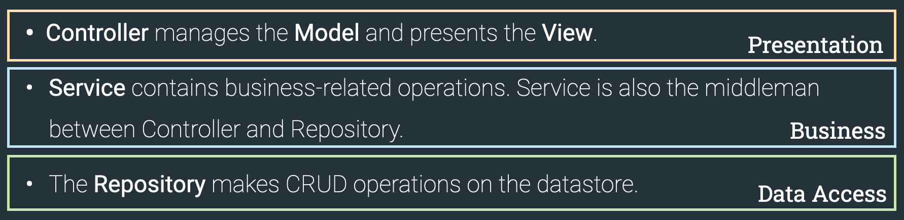

## Three Layer Architecture

### Presentation
- Controller
- Model (what populates the Thymeleaf templates)
- handler method responds with the view

### Business Logic
- Service class
- contains all business related operations 
- middle man between controller and repository

### Data Access
- Repository class
- CRUD Operations are inside the Repository class 

No direct communication between the **Presentation** (Controller) and **Data Access** (Repository class)

